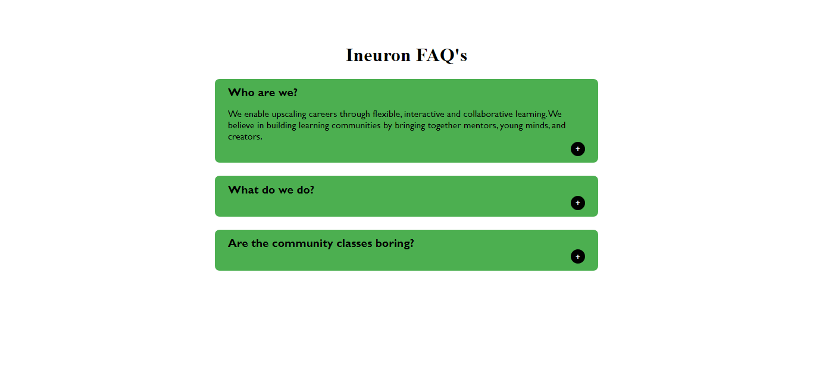

# JavaScript Accordion

## Description

A simple [Accordion](https://js-bgcolor.netlify.app/) Faq app when you click on button it displays the answer as drop-down. Learnt about basics of events, functions, creating elements, appending elements and loops in JavaScript.

### 📌Links for Project
- #### [LIVE Link]()

- #### [YouTube Video Demo](https://youtu.be/xdoHFdeSXrs)

### 📌Built With

- JavaScript

- Semantic HTML & CSS

### 📌Time Taken to finish this project

 

> 2 hours

 

### 📌Output Image

 

 

### 📌Checkout Portfolio & Other Projects

#### [Personal Portfolio](https://shubhambhoj.in/)

***
### 📌Connect with Me
* [Mailto](mailto:shubhambhoj3@gmail.com)
* [LinkedIn](https://www.linkedin.com/in/shubham-singh-b122b7171/)

***
[go to top](#javascript-accordion)