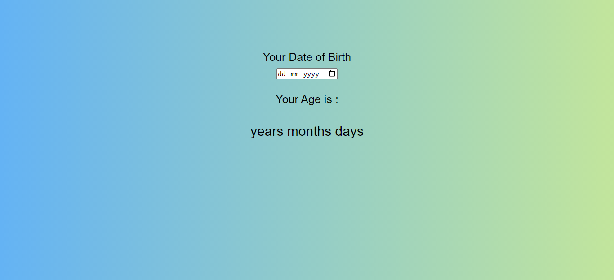

# JavaScript Age Calculator

## Description

A [Age Calculator]() app which shows the age of a person in YYYY-MM-DD format. Learnt about event listeners, Date and functions in JavaScript.

### 📌Links for Project
- #### [LIVE Link]()

- #### [YouTube Video Demo]()

### 📌Built With

- JavaScript

- Semantic HTML & CSS

### 📌Time Taken to finish this project

 

> 4 hours

 

### 📌Output Images

 

.png)

 

### 📌Checkout Portfolio & Other Projects

#### [Personal Portfolio](https://shubhambhoj.in/)

***
### 📌Connect with Me
* [Mailto](mailto:shubhambhoj3@gmail.com)
* [LinkedIn](https://www.linkedin.com/in/shubham-singh-b122b7171/)

***
[go to top](#javascript-age-calculator)