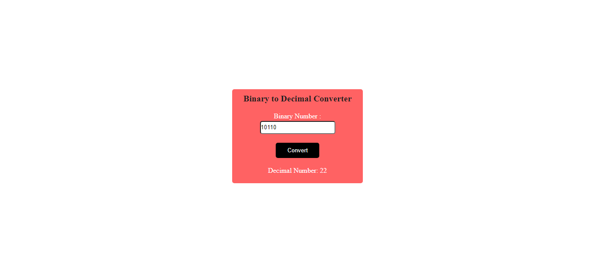

# JavaScript Binary to Decimal Converter

## Description

A [Binary to Decimal Converter]() page which converts the inputed binary number to equivalent decimal number. Learnt about event listeners and functions in JavaScript.

Used as Reference:

For binary number with n digits:

dn-1 ... d3 d2 d1 d0

The decimal number is equal to the sum of binary digits (dn) times their power of 2 (2n):

decimal = d0×20 + d1×21 + d2×22 + ...

Example:
Decimal value of 1110012:

| binary number:| 1   1  1  0  0  1    |
| ------------- | ------------- |
| power of 2:  | 25	24	23	22	21 20 |

1110012 = 1⋅25+1⋅24+1⋅23+0⋅22+0⋅21+1⋅20 = 5710

 

### 📌Links for Project
- #### [LIVE Link]()

- #### [YouTube Video Demo]()

### 📌Built With

- JavaScript

- Semantic HTML & CSS

### 📌Time Taken to finish this project

 

> 1/2 hour

 

### 📌Output Images

 

.png)

 

### 📌Checkout Portfolio & Other Projects

#### [Personal Portfolio](https://shubhambhoj.in/)

***
### 📌Connect with Me
* [Mailto](mailto:shubhambhoj3@gmail.com)
* [LinkedIn](https://www.linkedin.com/in/shubham-singh-b122b7171/)

***
[go to top](#javascript-binary-to-decimal-converter)