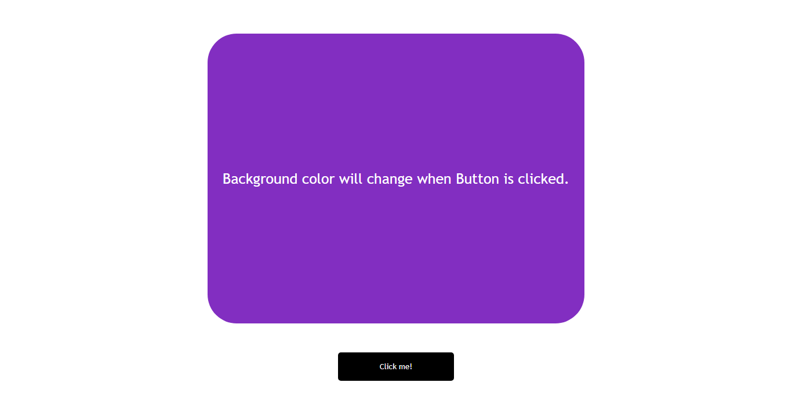

# JavaScript Color Changer App

## Description

A simple [Background Color Changer](https://js-bgcolor.netlify.app/) app when you click on button. Learnt about basics of events and loops in javaScript.

### 📌Links for Project
- ### <a href="https://js-bgcolor.netlify.app/" target="_blank">LIVE LINK</a>

- [YouTube Video Demo](https://youtu.be/xdoHFdeSXrs)

### 📌Built With

- JavaScript

- Semantic HTML & CSS

### 📌Time Taken to finish this project

 

> 30 minutes to finish this mini-project

 

### 📌Output Image

 

 

### 📌Checkout Portfolio & Other Projects

#### [Personal Portfolio](https://shubhambhoj.in/)

***
### 📌Connect with Me
* [Mailto](mailto:shubhambhoj3@gmail.com)
* [LinkedIn](https://www.linkedin.com/in/shubham-singh-b122b7171/)

***
***
[go to top](#javascript-color-changer-app)