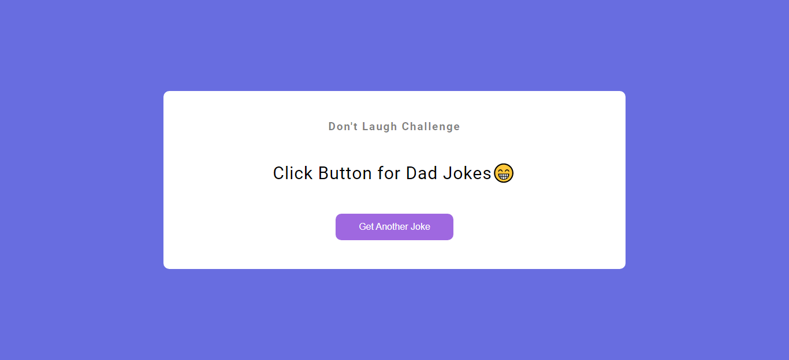

# JavaScript Jokes Generator - API

## Description

A [Jokes Generator](https://randomjokes-api.netlify.app/) app with the help of Dad Jokes [API](https://icanhazdadjoke.com/) when you click on button it displays  random dad jokes. Learnt about how to fetch and handle APIs in JavaScript.

### 📌Links for Project
- #### [LIVE Link](https://randomjokes-api.netlify.app/)

- #### [YouTube Video Demo](https://youtu.be/1mFa8Gsr9NM)

### 📌Built With

- JavaScript

- Semantic HTML & CSS

### 📌Time Taken to finish this project

 

> 1 hour

 

### 📌Output Images

 

.png)

 

### 📌Checkout Portfolio & Other Projects

#### [Personal Portfolio](https://shubhambhoj.in/)

***
### 📌Connect with Me
* [Mailto](mailto:shubhambhoj3@gmail.com)
* [LinkedIn](https://www.linkedin.com/in/shubham-singh-b122b7171/)

***
[go to top](#javascript-jokes-generator---api)