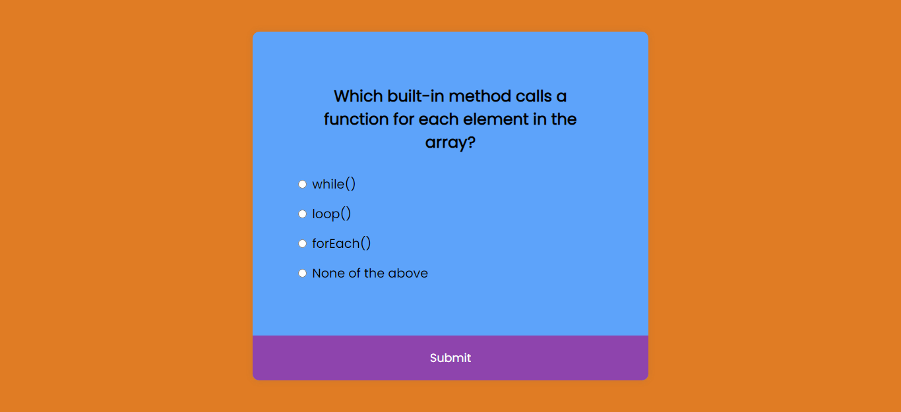

# ⭐ JavaScript Mini Projects

## Description

Includes mini projects like color changer, password generator, jokes generator-api, calculator and many more. Added the functionality. Tech Stack used: HTML, CSS, Bootstrap, JavaScript.

 

## ⭐ Project 01:  Accordion

- ### 📌<a href="https://accordion-fs.netlify.app/" target="_blank">LIVE LINK</a>

- ### 📌<a href="https://youtu.be/0yuP3c9CPw4" target="_blank">YouTube Video Demo</a>

- ### 📌[Source Code](https://github.com/ShubhamSingh03/JavaScript_MiniProjects/tree/main/Accordion)

### Output Image

 

 

## ⭐ Project 02:  Age Calculator

- ### 📌<a href="https://age-finder.netlify.app/" target="_blank">LIVE LINK</a>

- ### 📌<a href="https://youtu.be/a4060K_U8Hk" target="_blank">YouTube Video Demo</a>

- ### 📌[Source Code](https://github.com/ShubhamSingh03/JavaScript_MiniProjects/tree/main/Age-Calculator)

### Output Image

 

.png)

 

## ⭐ Project 03:  Basic Counter

- ### 📌<a href="https://incrementer.netlify.app/" target="_blank">LIVE LINK</a>

- ### 📌<a href="https://youtu.be/Q9oGAw_O-wo" target="_blank">YouTube Video Demo</a>

- ### 📌[Source Code](https://github.com/ShubhamSingh03/JavaScript_MiniProjects/tree/main/BasicCounter)

### Output Image

 

 

## ⭐ Project 04:  Binary to Decimal

- ### 📌<a href="https://b2dconverter-js.netlify.app/" target="_blank">LIVE LINK</a>

- ### 📌<a href="https://youtu.be/TpiBPNBh_qs" target="_blank">YouTube Video Demo</a>

- ### 📌[Source Code](https://github.com/ShubhamSingh03/JavaScript_MiniProjects/tree/main/BinaryToDecimal)

### Output Image

 

.png)

 

## ⭐ Project 05: Calculator

- ### 📌<a href="https://fsjs-calculator.netlify.app/" target="_blank">LIVE LINK</a>

- ### 📌<a href="https://youtu.be/gDPXMoZrMJA" target="_blank">YouTube Video Demo</a>

- ### 📌[Source Code](https://github.com/ShubhamSingh03/JavaScript_MiniProjects/tree/main/Calculator)

### Output Image

 

.png)

 

## ⭐ Project 06:  Click the Button

- ### 📌<a href="https://click-jsbutton.netlify.app/" target="_blank">LIVE LINK</a>

- ### 📌<a href="https://youtu.be/8xrNKBzbyrY" target="_blank">YouTube Video Demo</a>

- ### 📌[Source Code](https://github.com/ShubhamSingh03/JavaScript_MiniProjects/tree/main/ClickTheButton)

### Output Image

 

 

## ⭐ Project 07: Color Changer App

- ### 📌<a href="https://js-bgcolor.netlify.app/" target="_blank">LIVE LINK</a>

- ### 📌<a href="https://youtu.be/xdoHFdeSXrs" target="_blank">YouTube Video Demo</a>

- ### 📌[Source Code](https://github.com/ShubhamSingh03/JavaScript_MiniProjects/tree/main/ColorChanger%20App)

### Output Image

 

 

## ⭐ Project 08:  Jokes Generator - API

- ### 📌<a href="https://randomjokes-api.netlify.app/" target="_blank">LIVE LINK</a>

- ### 📌<a href="https://youtu.be/1mFa8Gsr9NM" target="_blank">YouTube Video Demo</a>

- ### 📌[Source Code](https://github.com/ShubhamSingh03/JavaScript_MiniProjects/tree/main/JokesGenerator%20-%20API)

### Output Image

 

.png)

 

## ⭐ Project 09:  Js Quiz App

- ### 📌<a href="https://fsjs-quiz.netlify.app/" target="_blank">LIVE LINK</a>

- ### 📌<a href="https://youtu.be/nGXPJEeD0u4" target="_blank">YouTube Video Demo</a>

- ### 📌[Source Code](https://github.com/ShubhamSingh03/JavaScript_MiniProjects/tree/main/JsQuizApp)

### Output Image

 

 

## ⭐ Project 10:  Password Generator

- ### 📌<a href="https://pwd-creator.netlify.app/" target="_blank">LIVE LINK</a>

- ### 📌<a href="https://youtu.be/M3pFIz4ySoY" target="_blank">YouTube Video Demo</a>

- ### 📌[Source Code](https://github.com/ShubhamSingh03/JavaScript_MiniProjects/tree/main/PasswordGenerator)

### Output Image

 

 

## ⭐ Project 11:  See What You Type

- ### 📌<a href="https://typing-proplus.netlify.app/" target="_blank">LIVE LINK</a>

- ### 📌<a href="https://youtu.be/qotjvTG5oQs" target="_blank">YouTube Video Demo</a>

- ### 📌[Source Code](https://github.com/ShubhamSingh03/JavaScript_MiniProjects/tree/main/SeeWhatYouType)

### Output Image

 

.png)

 

### ⭐ Checkout Portfolio & Other Projects

#### [Personal Portfolio](https://shubhambhoj.in/)

#### [Findcoder Profile](https://www.findcoder.io/u/shubham_singh)

***
### ⭐ Connect with Me
* [Mailto](mailto:shubhambhoj3@gmail.com)

* [LinkedIn](https://www.linkedin.com/in/shubham-singh-b122b7171/)
***
***
[go to top](#⭐-javascript-mini-projects)

